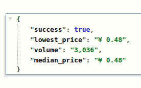

# Steam Inventory Price Provider



A Node.js server to provide steam inventory price in steam community market
supported proxy address list to avoiding steam api limit.

So, you can buy some proxies ip and set up this server.

## How to use

``` bash
# install environments
npm install --production;
npm install pm2 -g;

# create configurations
cp example.config.server.js config.server.js
echo "default proxies address" > config.proxy.list

# start server
pm2 start ecosystem.yaml;
```

## Test

``` bash
curl '127.0.0.1:4000/';
curl '127.0.0.1:4000/?country=CN&currency=23&appid=753&market_hash_name=762800-%3A2017eyeball%3A';
```

## Author

LiuYue [@hangxingliu](https://github.com/hangxingliu)

## License

[Apache-2.0](LICENSE)
